  

<h1 align="center">Digital Lifeline</h1>

  <b>Survivability-Governed Data Architecture</b> 
  Fragmentation • Encryption • Distribution • Reconstruction

  
  
  
  

  <b>DATA SHOULD SURVIVE FAILURE ITSELF</b>

---

# 🧠 Core Idea

Digital Lifeline explores a survivability-first approach to data continuity.

Instead of trusting a single device, cloud, or storage provider,
the architecture distributes encrypted fragments across independent environments.

The goal is simple:

> If part of the infrastructure fails, data continuity should still survive.

---

# ⚡ Survivability Pipeline

  

  <b>FRAGMENT → ENCRYPT → DISTRIBUTE → MULTI-SINK STORAGE → RECONSTRUCT</b>

---

# 🌐 Related Runtime Surfaces

| Surface | Purpose | Link |
|---|---|---|
| XPADI-SGDS | Canonical SGDS ecosystem root | https://github.com/raajmandale/XPADI-SGDS |
| XPADI Proof Engine | Runtime continuity reactor | https://raajmandale.github.io/XPADI_Proof_Engine_V1/ |
| XPADI-ProofCheck | Recovery intelligence surface | https://xpadi.com/proofcheck/ |
| Research Paper | SGDS architecture & theory | https://zenodo.org/records/19500143 |

---

# 🧬 Architecture Layers

| Layer | Purpose |
|---|---|
| Fragment Engine | Split files into survivable fragments |
| Encryption Layer | Encrypt fragments before distribution |
| Distribution Engine | Spread fragments across independent sinks |
| Multi-Sink Storage | Remove single-point dependency |
| Reconstruction Engine | Restore original file from surviving fragments |

---

# ⚙️ Survivability Model

Digital Lifeline explores continuity under conditions such as:

- ransomware attacks
- SSD or HDD failure
- cloud lockout
- accidental deletion
- storage corruption
- device loss
- partial infrastructure collapse

The architecture assumes:

- storage providers may fail
- infrastructure cannot be fully trusted
- continuity must remain automatic
- survivability matters more than storage location

---

# 🔬 Core Principle

Traditional systems focus on:

- backup location
- replication count
- storage capacity

Digital Lifeline focuses on:

> whether continuity itself can survive disruption.

---

# 📊 Operational Direction

The architecture explores:

- deterministic reconstruction
- fragment survivability
- distributed continuity
- infrastructure resilience
- reconstruction confidence
- recovery intelligence

without relying on a single trusted sink.

---

# 🚀 Strategic Direction

Past
- local backup
- RAID protection
- single-device recovery

Present
- distributed survivability
- encrypted fragment continuity
- multi-sink reconstruction

Future
- AI-native memory continuity
- survivability-first infrastructure
- autonomous continuity systems

---

# 👤 Author

Raaj Mandale  
Founder & Systems Architect  
ERANEST Technoware Pvt Ltd

🌐 https://raajmandale.in

---

# 📄 License

MIT License

---

# Final Statement

If a single failure can permanently destroy data,
the infrastructure was never truly survivable.